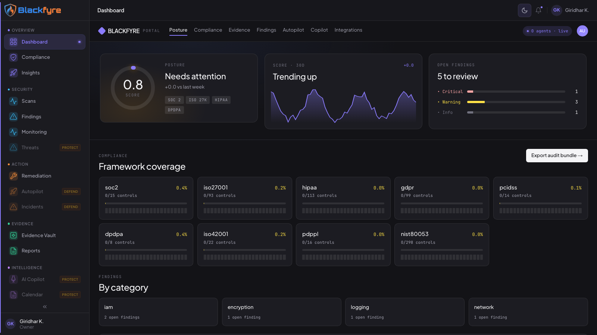
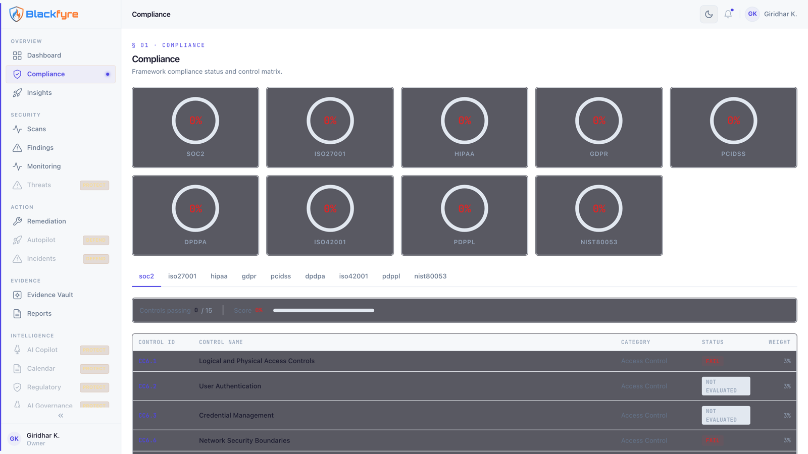

<div align="center">

# Blackfyre

**Open-source multi-cloud compliance & security platform**

Scan AWS, Azure, and GCP against 678 controls across 9 compliance frameworks —
with AI-assisted analysis, hash-verified evidence, and real remediation tracking.

[](LICENSE)
[](https://github.com/blackfyre-security/blackfyre/actions/workflows/ci.yml)
[](https://github.com/blackfyre-security/blackfyre/releases)
[](https://github.com/blackfyre-security/blackfyre/discussions)
[](https://github.com/blackfyre-security/blackfyre/labels/good%20first%20issue)
[](https://codespaces.new/blackfyre-security/blackfyre)

[Quickstart](#quickstart) · [Coverage](#compliance--cloud-coverage) · [Docs](#documentation) · [Contributing](#contributing) · [Security](SECURITY.md) · [Hosted option](https://blackfyre.tech)

</div>

---

## What is Blackfyre?

Blackfyre is a multi-tenant compliance platform that audits your cloud
infrastructure and turns the results into framework-mapped compliance posture. It
deploys scanning agents across AWS, Azure, GCP (and on-prem targets), maps every
finding to the controls it affects, scores your posture per framework, and walks
findings through remediation — with evidence you can hand to an auditor.

## Key features

- **Multi-cloud scanning** — 40+ SDK-based auditors (IAM, storage, compute,
  networking, encryption, logging) plus Prowler and IaC scanning
  (Checkov/Semgrep/Bandit) as containerized scanners
- **9 compliance frameworks, 678 controls** — SOC 2, ISO 27001, HIPAA, GDPR,
  PCI-DSS, DPDPA, ISO 42001, PDPPL, NIST 800-53, with weighted control scoring
  ([coverage table](#compliance--cloud-coverage))
- **AI-assisted analysis** — gap analysis, MITRE ATT&CK mapping, remediation
  suggestions, and a security copilot (Claude via Anthropic API or AWS Bedrock);
  every AI feature degrades gracefully to heuristics when no key is configured
- **Evidence vault** — SHA-256 content hashing with an explicit `hashSource` on
  every record, so a hash that covers real evidence bytes is distinguishable from
  one that only covers collection metadata. S3 Object Lock (WORM, COMPLIANCE mode)
  on AWS deployments; local self-hosted storage has no Object Lock. The chained
  ledger (`services/ledger/`) is implemented but not yet wired into the write path
- **Real-time monitoring** — configuration drift detection and live scan progress
  over SSE
- **Serious multi-tenancy** — Postgres row-level security enforced below the ORM
  ([ADR-0001](docs/adr/0001-rls-multi-tenancy.md)), per-request tenant-bound
  connections, plan-based feature gating
- **Enterprise auth** — JWT + MFA, Google SSO, SAML, SCIM provisioning, API keys,
  auditor-scoped access

## Quickstart

**Zero-install:** [open the repo in GitHub Codespaces](https://codespaces.new/blackfyre-security/blackfyre)
— dependencies install automatically; then `npm run demo --workspace=packages/api`
(from `platform/`) serves a fully mocked API on :4001 with no database, or follow
the printed hint for the full stack.

Full local stack (no cloud account needed) — details in
[docs/developer/local-development.md](docs/developer/local-development.md):

```bash
git clone https://github.com/blackfyre-security/blackfyre.git && cd blackfyre/platform
docker compose up -d postgres redis localstack
npm install && npm run build
cp packages/api/.env.example packages/api/.env   # then edit per the local-dev guide
npm run db:migrate && npm run dev                # API on :4000
```

Then in one more terminal:

```bash
NEXT_PUBLIC_API_URL=http://localhost:4000 npm run dev --workspace=packages/portal   # :3001
```

Log in at http://localhost:3001 with the seeded dev user `admin@acme.com` /
`password123`.

## A look inside

The portal dashboard — posture score, framework coverage, and open findings at
a glance:



Per-framework compliance rings and the drill-down control matrix:



<!-- TODO: add a short GIF of scan → findings → score (capture per
  docs/COMMUNITY_PLAYBOOK.md), plus a finding-detail and evidence-chain shot
  from a scan-populated workspace. Current shots are from the seeded dev
  stack (docker compose + 003_seed_data). -->

## Compliance & cloud coverage

Every check maps findings onto the controls it evidences; posture is scored
per framework with weighted controls.

| Framework | Version | Controls |
|---|---|---:|
| SOC 2 | 2017 TSC | 15 |
| ISO/IEC 27001 | 2022 | 93 |
| HIPAA Security Rule | 2013 | 113 |
| GDPR | 2016 | 99 |
| PCI-DSS | 4.0 | 14 |
| India DPDPA | 2023 | 8 |
| ISO/IEC 42001 (AI) | 2023 | 22 |
| Qatar PDPPL | 2016 | 16 |
| NIST 800-53 | Rev 5 | 298 |
| **Total** | | **678** |

| Cloud | SDK auditors | Covers |
|---|---|---|
| AWS | 13 | IAM, S3, EC2/VPC, RDS, KMS, CloudTrail, GuardDuty, Config, Lambda, ECS/EKS, SQS/SNS, Secrets Manager, WAF |
| Azure | 11 | IAM, Storage, Compute, SQL, Key Vault, AKS, Defender, Monitor, Network, Policy, App Service |
| GCP | 10 | IAM, Storage, Compute, Cloud SQL, GKE, KMS, BigQuery, Network, Org Policy, Security Command Center |
| On-prem / other | 10+ | Active Directory, network/SNMP, endpoints, Kubernetes, SaaS, code repos, container registries, OT/SCADA |

Plus Prowler and IaC scanning (Checkov/Semgrep/Bandit) as containerized scanners.
Want a framework or check we don't have?
[Propose it](https://github.com/blackfyre-security/blackfyre/issues/new?template=new_check_proposal.yml) —
frameworks land as data, not code.

## Architecture

```
        Portal (Next.js)          Admin (Next.js)
           :3001                     :3003
              └───────────┬─────────────┘
                          v
                 REST API (Fastify)  :4000
                 JWT + CSRF + RLS-bound request.db
                          │
        ┌─────────────────┼─────────────────────┐
        v                 v                     v
  PostgreSQL 16      Redis            SQS queues (scan/monitor/AI/evidence + DLQs)
  (row-level         (rate limits,            │
   security)          caching)                v
                                     Workers ──> Scanners
                                     (SQS consumers)  ├─ SDK auditors (in-process)
                                                      └─ Prowler / IaC (container Lambdas)
                                              │
                                              v
                                     S3 evidence vault (Object Lock)
```

Locally, docker-compose provides Postgres/Redis and LocalStack emulates SQS/S3. In
production the same code deploys to AWS (Lambda + RDS + SQS + S3 + KMS) via SST —
see [docs/self-hosting.md](docs/self-hosting.md).

## Documentation

| Doc | What's in it |
|---|---|
| [docs/developer/local-development.md](docs/developer/local-development.md) | Verified 15-minute local setup, seeded logins, troubleshooting |
| [docs/developer/monorepo-map.md](docs/developer/monorepo-map.md) | Every package: what it is, key files, dependency direction |
| [docs/developer/configuration.md](docs/developer/configuration.md) | Every env var and secret, with safe local values |
| [docs/developer/testing.md](docs/developer/testing.md) | Unit / integration / Playwright suites and how to run one test |
| [docs/developer/migrations.md](docs/developer/migrations.md) | Migration ordering, idempotency, RDS gotchas, RLS pattern |
| [docs/developer/api-overview.md](docs/developer/api-overview.md) | Fastify app layout, auth model, how to add an endpoint |
| [docs/self-hosting.md](docs/self-hosting.md) | Local/evaluation vs production-on-AWS (SST), secrets, costs |
| [docs/ARCHITECTURE.md](docs/ARCHITECTURE.md) | Deployment topology and infra invariants |
| [ROADMAP.md](ROADMAP.md) | Near/mid/long-term direction and how to propose work |
| [docs/adr/](docs/adr/) | Architecture decision records ([RLS](docs/adr/0001-rls-multi-tenancy.md), [queues](docs/adr/0002-queue-architecture.md), [scanners](docs/adr/0003-scanner-orchestration.md), [model routing](docs/adr/0004-model-routing.md)) |
| [CONTRIBUTING.md](CONTRIBUTING.md) | Fork-and-PR flow, DCO sign-off, commit style |
| [SECURITY.md](SECURITY.md) | Private vulnerability disclosure |
| [GOVERNANCE.md](GOVERNANCE.md) · [CODE_OF_CONDUCT.md](CODE_OF_CONDUCT.md) | Project governance and conduct |

## Tech stack

Fastify 4 + Drizzle ORM + Zod on Node 20 · Next.js 14 static exports · PostgreSQL 16
with RLS · Redis · SQS · S3 · Anthropic Claude / AWS Bedrock · SST (AWS) ·
GitHub Actions

## Contributing

Blackfyre needs two kinds of contributors, and only one of them writes code:

- **Compliance & security knowledge** — control interpretations, framework
  mappings, new check proposals. Frameworks land as data, not code; if you know
  what an auditor actually asks for, you can improve every user's coverage
  without touching TypeScript.
- **Code** — cloud auditors, platform features, DX. TypeScript monorepo with a
  [15-minute local setup](docs/developer/local-development.md), no cloud
  account required.

Start with a [`good first issue`](https://github.com/blackfyre-security/blackfyre/labels/good%20first%20issue),
read [CONTRIBUTING.md](CONTRIBUTING.md) (including the
[new check guide](CONTRIBUTING.md#adding-a-cloud-check-or-framework-mapping)),
or just ask in [Discussions](https://github.com/blackfyre-security/blackfyre/discussions).
The [roadmap](ROADMAP.md) shows where the project is headed.

## License & trademark

Apache-2.0 — see [LICENSE](LICENSE) and [NOTICE](NOTICE). "Blackfyre" and the
Blackfyre logo are trademarks; see [TRADEMARK.md](TRADEMARK.md) for permitted use.

## Hosted option

Don't want to run it yourself? A hosted version is available at
[blackfyre.tech](https://blackfyre.tech).
